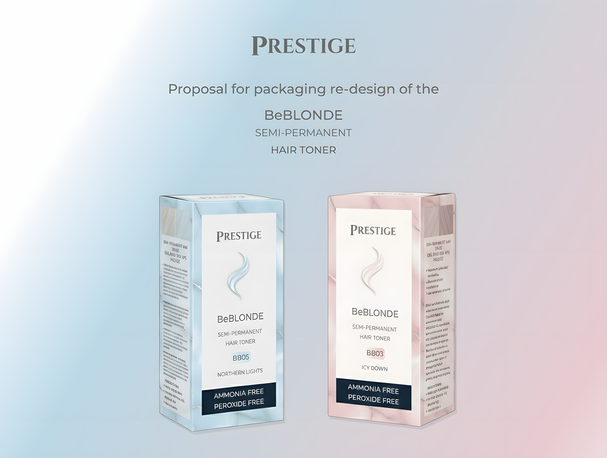
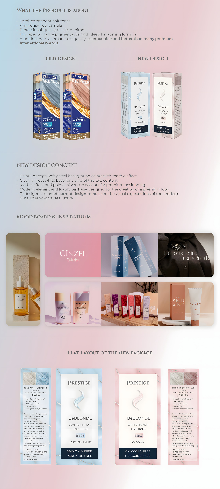
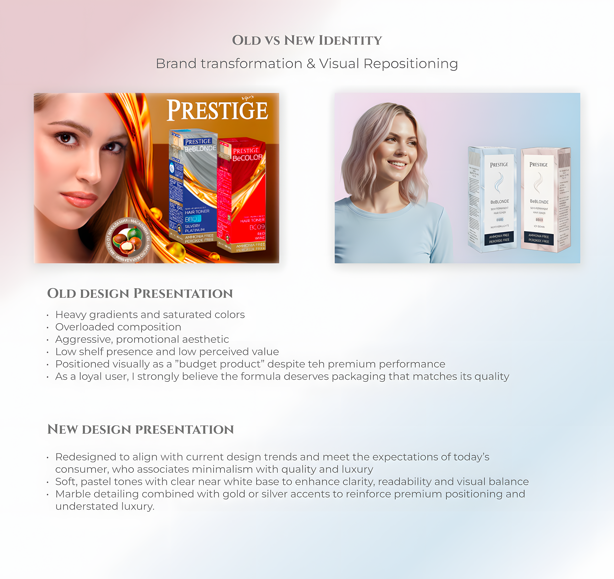
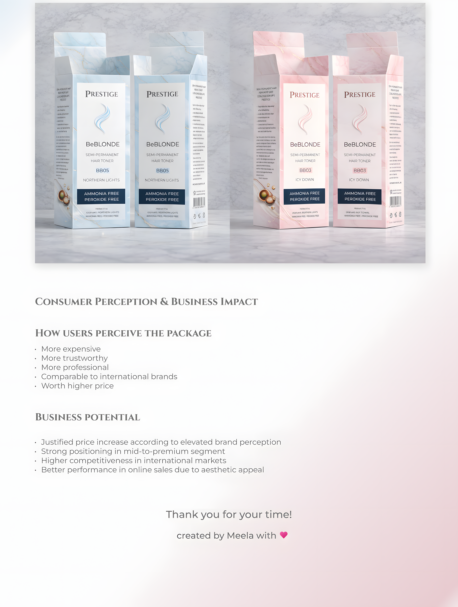

This project is especially meaningful to me, as I truly want to support Bulgarian producers. The "Prestige" hair toner is a product of the Bulgarian company Rosa Impex Ltd. and the toner itself offers outstanding quality – comparable to premium luxury international products in the same category. However, its current packaging feels outdated, reflecting design trends from the 80s with a large golden badge, bright colors and an unrefined font selection. I redesigned the packaging with a more premium and minimalistic approach, using soft pastel tones to create a modern and elevated look. The goal is to reposition the product, making it more appealing to a younger, style-conscious audience – such as GenZ and higher-end consumers. This updated visual identity not only enhances the brand perception but also leads to a higher recognition, increased demand and the potential for a justified price increase.

