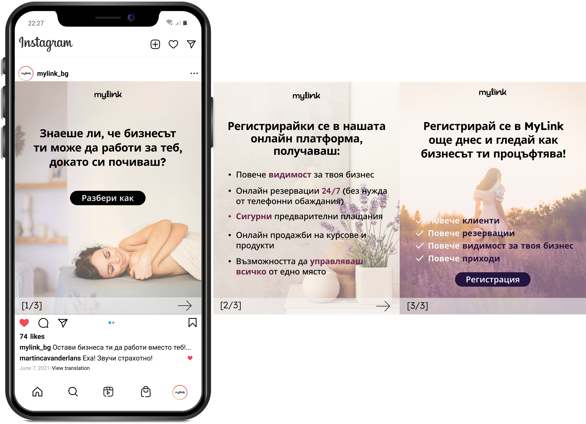
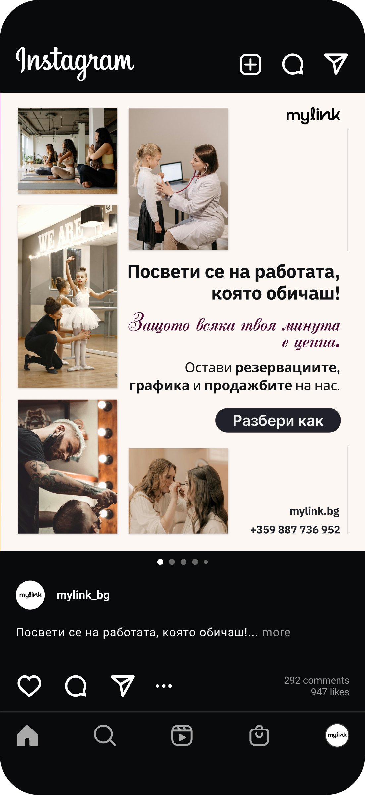
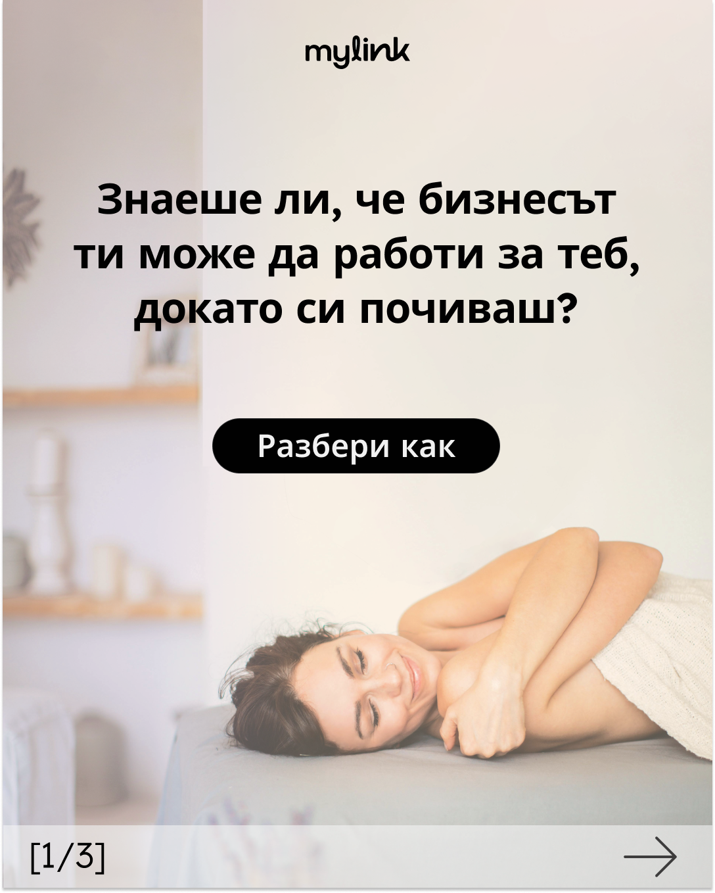
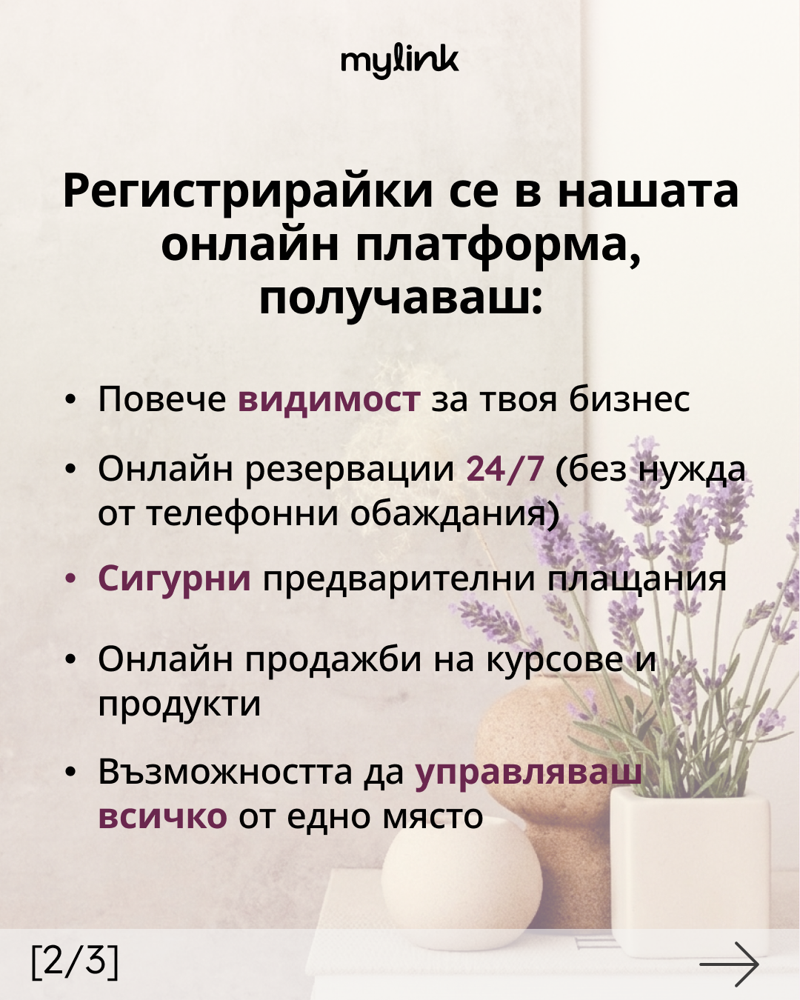

The business owners of the newly launched digital platform want to make their online booking solution more visible to potential B2B clients. Their target customers are sole traders like hairdressers, doctors, dance/sports teachers, who often struggle to keep up with their busy and often changing schedules.

The posts that I created are meant to show them how much easier their daily work could become with the online booking system of the platform. It would enable their customers to easily make bookings online without phone calls. The presence of the platform in social media would also increase MyLink's visibility and attract more users over time.

The first post is a carousel with a soft lavender background and a light ivory-to-sandy gradient. The calm look is designed to help viewers feel relaxed, while also sending them the simple message: the platform keeps working for them even when they're taking taking a break.

