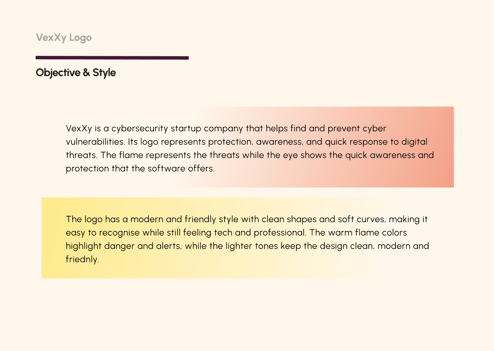
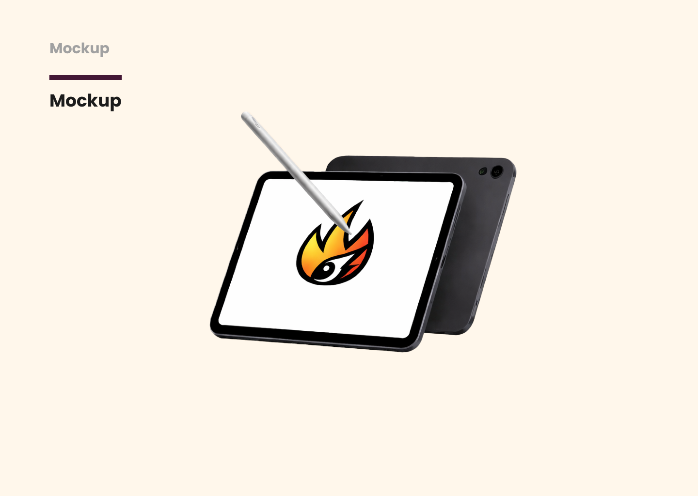
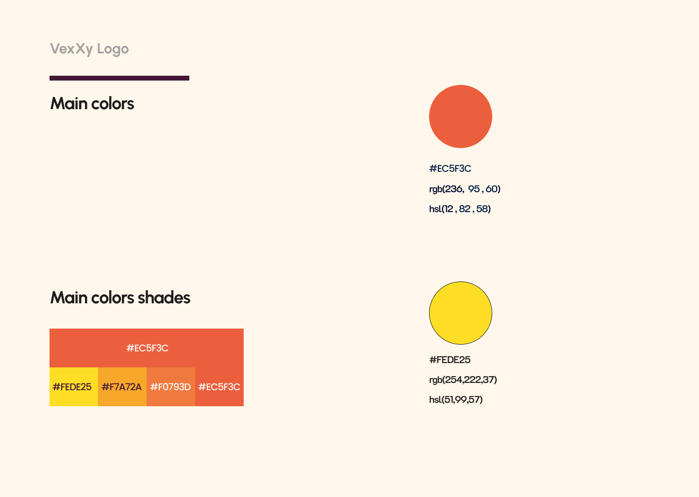

I created this logo for "VexXy", a cybersecurity startup focused on identifying and preventing digital threats. The goal was to visually communicate protection, awareness and fast response to threats in a simple and recognizable way. I combined an eye symbol with a flame element to represent the constant danger of cyber attacks but also the eye symbolizing the constant monitoring and risk control that the software offers. The design uses clean shapes, soft curves and warm alert colors to balance a sense of danger with a modern, friendly feel. Overall, the purpose was to build a strong, recognizable identity that feels both professional and user-friendly.

