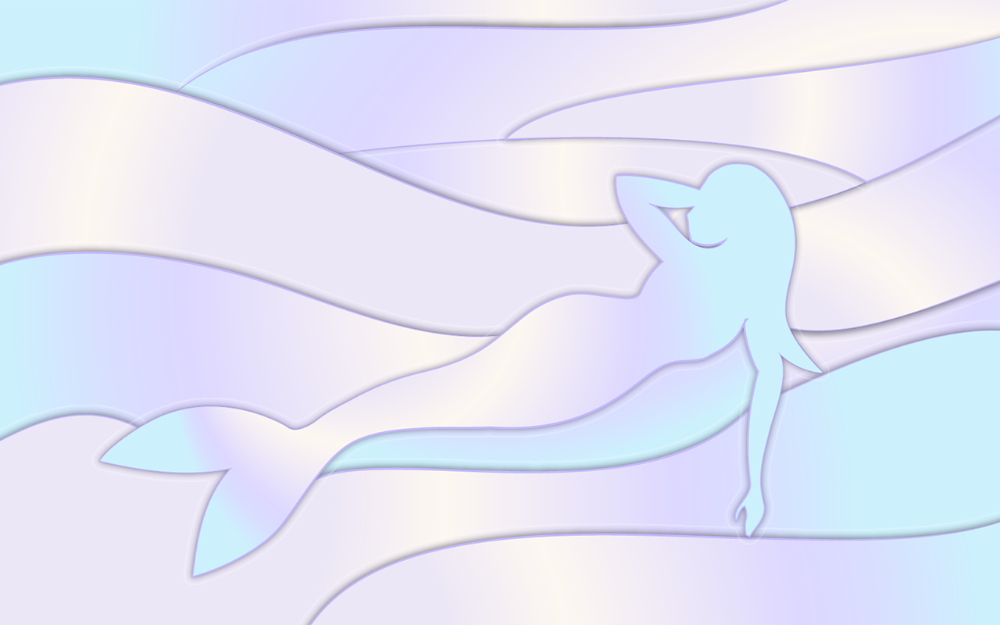

## Neon Web Surfaces

This project explores the use of neon colors and holographic backgrounds to create visually striking web interfaces.

## Key Features

- Interactive neon buttons
- Holographic gradients
- Responsive layouts

## Gallery

See the full project for code samples and live demos. 